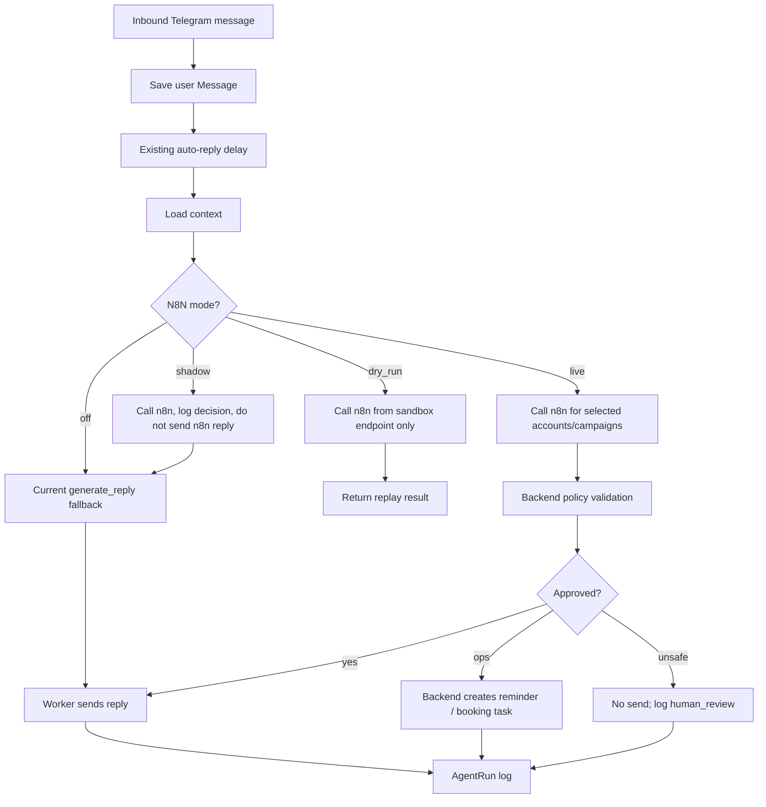

# n8n Agent System Plan

## Цель

Перевести auto-reply с одного промпта на тестируемый n8n orchestration layer, не ломая текущий Telegram runtime, кампании и ручную отправку.

Главный принцип: n8n принимает агентное решение, backend валидирует и выполняет действия. Telegram-сообщения отправляет только worker через существующий `send_manual_message`.

## Текущая точка в системе

Сейчас live auto-reply работает так:

1. `backend/telegram_client.py::_handle_message` получает входящее Telegram-сообщение.
2. Создаёт или находит `Conversation`.
3. Сохраняет `Message(role="user")`.
4. Проверяет DNC, stop keywords, paused, max messages, account/settings auto-reply flags.
5. Планирует delay через `_schedule_auto_reply`.
6. `_run_scheduled_auto_reply` после delay собирает контекст через `_load_auto_reply_context`.
7. Вызывает `backend/gpt_handler.py::generate_reply`.
8. `meeting_scheduler` ищет marker `[[BOOK_MEETING]]`, может создать Google Calendar + Zoom.
9. `send_manual_message` отправляет ответ.

Новая система должна заменить только шаги 7-8, оставив шаги 1-6 и 9 как safety boundary.

## Архитектура v1



## n8n workflow contract

Backend sends one webhook request to n8n:

```json
{
  "event_id": "auto-reply:conversation_id:trigger_message_id",
  "mode": "shadow|live|sandbox",
  "conversation": {},
  "messages": [],
  "settings": {
    "timezone": "Europe/Moscow",
    "meeting_window": "16:00-22:00",
    "duration_minutes": 30
  },
  "constraints": {
    "do_not_send_links": true,
    "do_not_claim_booking_without_record": true,
    "do_not_promise_reminder_without_task": true
  }
}
```

n8n must return structured JSON:

```json
{
  "approved": true,
  "stage": "qualification|scheduling|defer|closing|referral|async",
  "intent": "trust_question|availability_offer|ask_followup_later|hard_decline|async_offer|ops_problem|other",
  "reply_text": "Короткий ответ для Telegram",
  "ops_action": "none|set_reminder|request_email|create_booking|human_review|close_thread",
  "reminder": {
    "due_at": null,
    "reason": ""
  },
  "booking": {
    "start_at": null,
    "duration_minutes": 30,
    "attendee_email": null
  },
  "risk_flags": [],
  "reason": "Почему выбран такой шаг"
}
```

OpenAI Structured Outputs should be used inside n8n or backend for these stages when possible. Official OpenAI docs recommend Structured Outputs over plain JSON mode when schema adherence matters.

## Backend changes

### Milestone 1 — N8N adapter and decision schema `[x]`

Goal: backend can call n8n and store a decision without affecting live replies.

Tasks:

- [x] Add `backend/n8n_agent.py`.
- [x] Define Pydantic models:
  - `N8nAgentRequest`
  - `N8nAgentDecision`
  - `ReminderPayload`
  - `BookingPayload`
- [x] Add env/config:
  - `N8N_AGENT_WEBHOOK_URL`
  - `N8N_AGENT_SHARED_SECRET`
  - `N8N_AGENT_MODE=off|shadow|live`
  - `N8N_AGENT_ACCOUNT_IDS`
  - `N8N_AGENT_CAMPAIGN_IDS`
- [x] Add `call_n8n_agent(...)` with timeout and clear failure result.
- [x] Log every n8n sandbox call into existing `AgentRun`.

Definition of done:

- Shadow call can be executed from a test without sending Telegram messages.
- If n8n fails, current auto-reply fallback still works.

Validation:

```bash
pytest tests/test_outreach_runtime.py -k 'n8n or auto_reply'
```

Known risks:

- n8n timeout could block reply. Mitigation: short timeout and fallback in shadow/off.

Stop-and-fix rule:

- If fallback can be skipped accidentally after n8n failure, stop and fix before next milestone.

### Milestone 2 — Sandbox replay through n8n `[x]`

Goal: test n8n decisions on real exported conversations without sending messages.

Tasks:

- [x] Extend `/api/sandbox/replay` with `engine="local|n8n"`.
- [x] When `engine="n8n"`, send the selected conversation to n8n with `mode="sandbox"`.
- [x] Return full decision JSON, policy result, and `would_send=false`.
- [x] Show engine selector in `AgentsLab` sandbox tab.
- [x] Keep existing local heuristic sandbox as fallback.

Definition of done:

- User can enter `conversation_id`, pick n8n engine, run replay, and see classifier/planner/writer/verifier output.
- No Telegram message is sent.

Validation:

```bash
pytest tests/test_outreach_runtime.py -k sandbox
npm --prefix frontend run build
```

Known risks:

- n8n workflow may return malformed JSON. Mitigation: backend schema validation and visible error in sandbox.

Stop-and-fix rule:

- If invalid n8n output appears as successful, stop and fix validation.

### Milestone 3 — Policy layer before send `[~]`

Goal: backend blocks unsafe replies independently of prompts.

Tasks:

- [x] Add `backend/agent_policy.py`.
- [~] Enforce:
  - no Zoom/calendar link unless booking record exists;
  - no “инвайт отправлен” unless booking success exists;
  - no reminder promise unless reminder task is created;
  - no empty reply;
  - no technical markers like `[[...]]`;
  - no live send when `approved=false`.
- [x] Log blocked sandbox decision as `AgentRun(status="blocked")`.

Definition of done:

- Unsafe n8n output does not send.
- User can inspect reason in Agent Lab run logs.

Validation:

```bash
pytest tests/test_outreach_runtime.py -k 'policy or agent'
```

Known risks:

- Over-blocking valid text. Mitigation: start strict in sandbox/shadow; loosen only after replay evidence.

Stop-and-fix rule:

- If policy permits fake booking/reminder claims, stop and fix.

### Milestone 4 — Shadow mode in live inbound flow

Goal: n8n runs on live messages but does not control replies yet.

Tasks:

- [ ] In `_run_scheduled_auto_reply`, after context load, call n8n when `N8N_AGENT_MODE=shadow` and account/campaign is allowed.
- [ ] Continue sending the old `generate_reply` result.
- [ ] Store n8n decision and old reply side by side in `AgentRun`.
- [ ] Add runtime logs:
  - `auto_reply_n8n_shadow_started`
  - `auto_reply_n8n_shadow_completed`
  - `auto_reply_n8n_shadow_failed`

Definition of done:

- Production can collect n8n decisions without changing user-visible behavior.

Validation:

```bash
pytest tests/test_outreach_runtime.py -k auto_reply
```

Smoke:

- Send one test Telegram message to allowed account.
- Confirm old reply is sent.
- Confirm n8n decision appears in `/api/agents/runs`.

Known risks:

- Added latency. Mitigation: shadow timeout and no dependency on n8n result.

Stop-and-fix rule:

- If shadow mode changes outgoing text, stop and fix.

### Milestone 5 — Live mode for one account or one campaign

Goal: n8n controls replies only for an explicit allowlist.

Tasks:

- [ ] Enable `N8N_AGENT_MODE=live`.
- [ ] Require allowlist via `N8N_AGENT_ACCOUNT_IDS` or `N8N_AGENT_CAMPAIGN_IDS`.
- [ ] In live mode:
  - call n8n;
  - validate policy;
  - execute supported deterministic ops;
  - send `reply_text` only if approved.
- [ ] Fallback behavior:
  - if n8n fails before generating a decision, do not send or use old fallback depending on `N8N_AGENT_LIVE_FALLBACK=none|legacy`;
  - default must be `none` to avoid unexpected wrong replies.

Definition of done:

- Only allowlisted traffic uses n8n.
- Non-allowlisted traffic uses current auto-reply.
- Failed n8n decision does not create duplicate messages.

Validation:

```bash
pytest tests/test_outreach_runtime.py -k 'n8n or auto_reply or send'
```

Smoke:

- One live test conversation on allowlisted account.
- Verify exactly one outgoing reply.
- Verify AgentRun has input, output, policy, final action.

Known risks:

- Duplicate sends from retry. Mitigation: event_id/idempotency key based on `conversation_id` + `trigger_message_id`.

Stop-and-fix rule:

- Any duplicate send stops rollout.

### Milestone 6 — Reminder and booking primitives

Goal: support ops actions without letting n8n mutate production directly.

Tasks:

- [ ] Add `ReminderTask` model and migration columns via `init_db`.
- [ ] Add backend functions:
  - `create_reminder_task`
  - `cancel_superseded_reminders`
  - `run_due_reminders`
- [ ] Keep booking through existing `meeting_scheduler` initially.
- [ ] Add `BookingRecord` later only if existing `ScheduledMeeting` is insufficient.
- [ ] For v1, `create_booking` action can be blocked unless email/slot is sufficient.

Definition of done:

- n8n can request reminder creation, backend creates record, no promise is sent if creation fails.
- Existing Google Calendar/Zoom creation remains backend-owned.

Validation:

```bash
pytest tests/test_outreach_runtime.py -k 'reminder or meeting'
```

Known risks:

- Reminder runner sends after human resumed conversation. Mitigation: check latest message/last outbound author before sending.

Stop-and-fix rule:

- If reminder can fire after newer human activity without validation, stop and fix.

## n8n changes

### Workflow v1: `auto-reply-orchestrator`

Nodes:

1. Webhook trigger.
2. Validate shared secret.
3. Normalize conversation payload.
4. State Classifier LLM with structured output.
5. Strategy Planner LLM with structured output.
6. Reply Writer LLM with structured output.
7. Reply Verifier LLM or deterministic verifier node.
8. Return response to backend.

For the first test, this workflow does not call Telegram, Google Calendar, Zoom, or the database.

### Workflow v1 prompt boundaries

The n8n agent may decide:

- `reply_text`
- `stage`
- `intent`
- `ops_action`
- `reason`

The n8n agent must not:

- send Telegram messages;
- claim a booking exists;
- claim a reminder was created;
- create calendar events directly;
- write to the production database.

## Testing strategy

### Immediate test path

1. Deploy n8n locally or on Railway.
2. Build workflow with webhook and static response.
3. Configure backend in sandbox mode.
4. Run `/api/sandbox/replay` on exported replied conversations.
5. Inspect result in Agent Lab.
6. Switch to shadow mode on one account.
7. Compare old reply vs n8n decision in `AgentRun`.
8. Only then enable live mode on one test account.

### Replay acceptance checks

- No fake Zoom links.
- No “инвайт отправлен” without booking.
- No “напишу позже” without reminder action.
- Direct trust questions are answered before booking push.
- Declines close politely.
- Scheduling replies do not switch between manual slot and link.

## Assumptions

- n8n will be deployed as a separate service, not embedded as a full white-label editor in v1.
- Current backend remains source of truth for conversations, messages, meetings, and sends.
- Current Google Calendar + Zoom integration remains backend-owned.
- The first n8n version should be tested in sandbox/shadow before live traffic.
- Production rollout must be account/campaign allowlisted.

## Out of scope for this execution

- Full CRM.
- Direct n8n editor embedded inside React UI.
- Automatic external ICP enrichment.
- Complex reschedule/cancel flows.
- Replacing Telegram worker.
- Letting n8n send Telegram messages directly.
